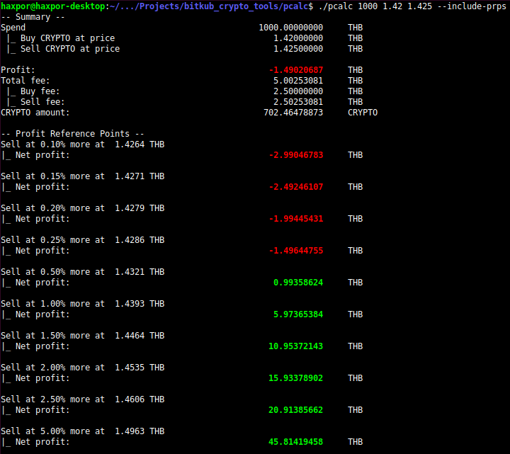

[](https://github.com/haxpor/donate)

# pcalc

Profit calculator with cryptocurrency neutral so it would work with any currency as it works with prices and volume.
It also list out fees, and further margin when sell based on percentage.

Other features would be added in the future if needed.

# Build

Currently support only on Linux platform.

Execute `make` to build the executable binary file `pcalc`.
Execute `make clean` to remove all artifacts from building process.

# Usage

Use `./pcalc --help` which has the main parameter like the following

```
Usage: pcalc <amount-to-spend> <CRYPTO-buy-price> <CRYPTO-sell-price>
```

## Default

For normal circumstance, by default we just execute the following command

```
./pcalc 89000 1763500 1777500
```

the result will be

```
-- Summary --
Spend                                              89000.00000000     THB
 |_ Buy CRYPTO at price                          1763500.00000000     THB
 |_ Sell CRYPTO at price                         1777500.00000000     THB

Profit:                                              258.57739403     THB
Total fee:                                           446.20570775     THB
 |_ Buy fee:                                         222.50000000     THB
 |_ Sell fee:                                        223.70570775     THB
CRYPTO amount:                                         0.05034165     CRYPTO

```

## More options

Available options which can be used are

* `--include-gross` - to include gross result (as from time to time, you might have free credits to do transactions or the platform itself allows free trading for short period of time)
* `--include-profit-ref-points` or `--include-prps` - to include several profit price points relative to the price you buy

Ex 1.

```
$ ./pcalc 10000 1.42 1.43 --include-gross
-- Summary --
Spend                                              10000.00000000     THB
 |_ Buy CRYPTO at price                                1.42000000     THB
 |_ Sell CRYPTO at price                               1.43000000     THB

Gross profit:                                         70.42253521     THB
Profit:                                               20.13336268     THB
Total fee:                                            50.11311620     THB
 |_ Buy fee:                                          25.00000000     THB
 |_ Sell fee:                                         25.11311620     THB
Gross CRYPTO amount:                                7042.25352113     CRYPTO
CRYPTO amount:                                      7024.64788732     CRYPTO

```

Ex 2.

```
./pcalc 10000 1.42 1.43 --include-prps
-- Summary --
Spend                                              10000.00000000     THB
 |_ Buy CRYPTO at price                                1.42000000     THB
 |_ Sell CRYPTO at price                               1.43000000     THB

Profit:                                               20.13336268     THB
Total fee:                                            50.11311620     THB
 |_ Buy fee:                                          25.00000000     THB
 |_ Sell fee:                                         25.11311620     THB
CRYPTO amount:                                      7024.64788732     CRYPTO

-- Profit Reference Points --
Sell at 0.10% more at  1.4314 THB
|_ Net profit:                                         5.07811230     THB

Sell at 0.15% more at  1.4321 THB
|_ Net profit:                                        10.07565381     THB

Sell at 0.20% more at  1.4329 THB
|_ Net profit:                                        15.07319533     THB

Sell at 0.25% more at  1.4336 THB
|_ Net profit:                                        20.07073684     THB

Sell at 0.50% more at  1.4371 THB
|_ Net profit:                                        45.05844442     THB

Sell at 1.00% more at  1.4443 THB
|_ Net profit:                                        95.03385956     THB

Sell at 1.50% more at  1.4514 THB
|_ Net profit:                                       145.00927471     THB

Sell at 2.00% more at  1.4586 THB
|_ Net profit:                                       194.98468985     THB

Sell at 2.50% more at  1.4657 THB
|_ Net profit:                                       244.96010500     THB

Sell at 5.00% more at  1.5015 THB
|_ Net profit:                                       494.83718073     THB

```

Ex 3. options can be combined together as well; which will show output from both flags

```
./pcalc 10000 1.42 1.43 --include-gross --include-prps
```

# Misc

Console output will highlight important numbers especially profit or loss with color for ease of seeing like below



# Notice

This tool suite is created independently without warranty. As well as please be advised and do your due diligent before investing, it has risk involved. This tool doesn't involve or responsible to any of operations done on top of this tool.

# License
MIT, Wasin Thonkaew
